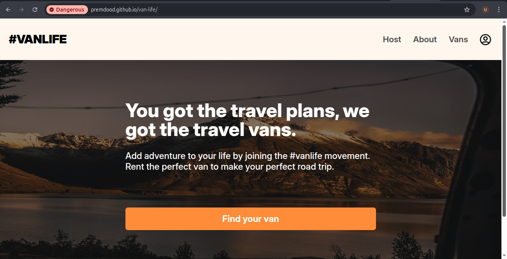
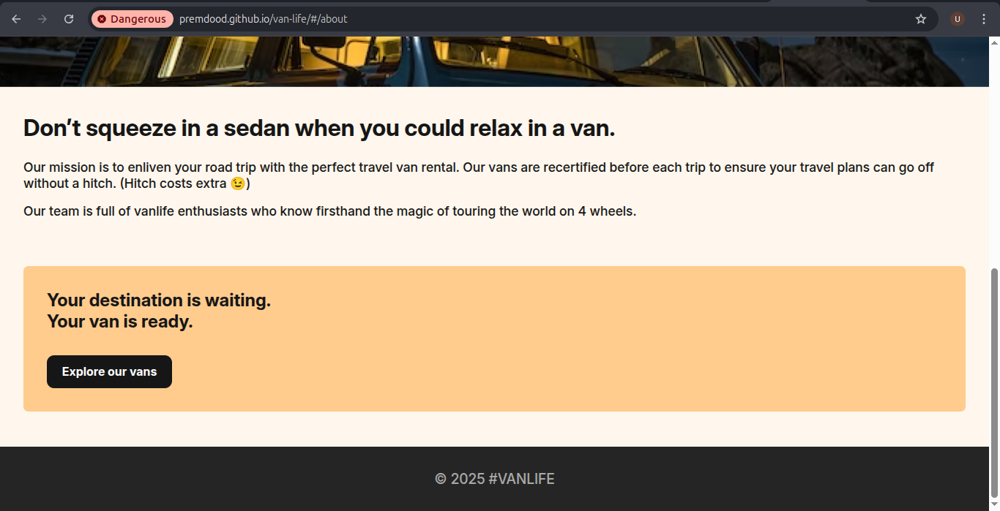
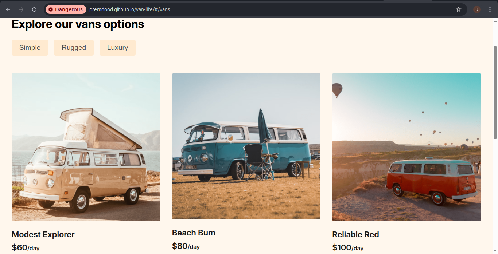
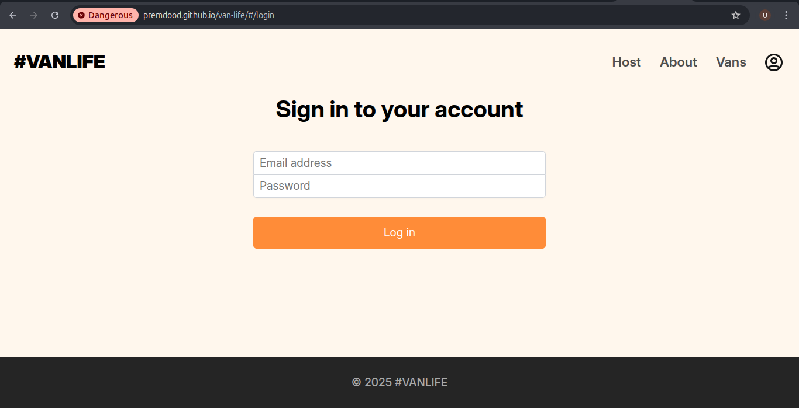

# 🚐 VanLife App

## 📝 Project Overview

VanLife is a modern web application that allows users to explore, rent, and list vans for unique travel experiences. Built with React and React Router, this frontend application provides a seamless interface for van enthusiasts to connect, rent, and host vans.

## 🌐 Live Demo
🔗 [View Live Demo](https://premdood.github.io/van-life)

## 🌟 Key Features

### User Features
- Browse available vans
- Filter vans by type (simple, luxury, rugged)
- Fake authentication system
- User profile management

### Host Features
- Van listing dashboard
- Income tracking per van
- Van details and performance metrics
- Add and manage van listings

## 🖥️ Screenshots






## 🛠️ Technologies Used

- **Frontend**: React
- **Routing**: React Router v6.4
- **State Management**: React Hooks
- **Styling**: CSS Modules
- **Mock Backend**: Local JSON data / Mirage JS (optional)

## 🚀 Getting Started

### Prerequisites
- Node.js (v14 or later)
- npm or Yarn

### Installation

1. Clone the repository
```bash
git clone https://github.com/premdood/van-life-app.git
```

2. Navigate to project directory
```bash
cd van-life-app
```

3. Install dependencies
```bash
npm install
```

4. Start the development server
```bash
npm start
```

## 🔐 Authentication

The app features a simulated authentication system with:
- Login/Logout functionality
- Protected routes for hosts
- Basic user role management

### Authentication Flow
1. User logs in with mock credentials
2. Receive simulated authentication token
3. Access protected routes based on user role

## 🌈 Key Components

### Vans Page
- Grid of available vans
- Filters by van type
- Search functionality

### Host Dashboard
- Van listing management
- Income tracking
- Van performance metrics

## 🚦 Routing

Implemented with React Router featuring:
- Public routes
- Protected host routes
- Dynamic van detail pages
- Nested routing for host sections

## 🔧 Customization

Easy to extend with:
- Additional van types
- More detailed host analytics
- Enhanced filtering options

## 📋 Planned Features

- Implement actual backend integration
- Add booking system
- Create more detailed user profiles
-Enhance van recommendation algorithm

## 🐛 Known Issues

- Mock authentication system
- Static data sources
- Limited error handling

---

**Disclaimer**: This is a frontend demonstration project with mock data and authentication.
